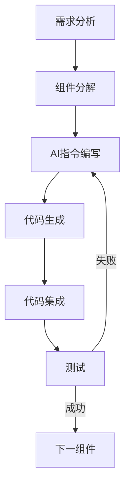

# ZenX AI辅助开发指南

## 一、AI辅助开发流程

### 开发模式概述
ZenX项目采用**AI辅助零基础开发模式**，通过结构化AI指令和模块化开发方法，帮助零基础开发者完成Flutter应用开发。

### 开发流程


## 二、AI指令模板

### 通用模板结构
```
## 任务描述
[明确描述要完成的任务]

## 技术要求
- 使用[技术/框架]
- 采用[设计风格]
- 兼容[特定需求]

## 已有代码上下文
[相关已有代码的简短描述或路径]

## 期望输出
[描述期望获得的代码输出]
```

### 组件开发指令模板
```
请创建一个Flutter组件[组件名称]，实现以下功能：
1. [功能点1]
2. [功能点2]

技术要求：
- 使用SwiftUI风格设计
- 优先使用Cupertino组件
- 支持深色/浅色模式适配
- 使用以下颜色规范：[列出颜色代码]

组件将在[父组件]中使用，需要接收以下参数：
- [参数1]: [类型和用途]
- [参数2]: [类型和用途]

请提供完整的组件代码，包括必要的导入语句。
```

### API集成指令模板
```
请实现[API名称]的集成代码，要求：
1. 遵循BaseChatAPI抽象类接口
2. 处理流式响应
3. 提供适当的错误处理

已知BaseChatAPI接口如下：
[粘贴BaseChatAPI接口代码]

请提供完整的实现代码。
```

## 三、模块化开发策略

### 独立组件先行原则
1. **先开发基础组件**：ChatBubble、MessageInputBar等
2. **再开发容器组件**：如ChatListView
3. **最后开发页面和逻辑**：完整的Chat Screen及状态管理

### 测试与集成策略
- 每个组件生成后先单独测试
- 使用简单的StatefulWidget包裹进行功能验证
- 确认无误后再集成到主应用

## 四、AI提示工程技巧

### 有效提示词编写
1. **明确性**：使用精确的技术术语，避免模糊表述
2. **上下文提供**：提供必要的现有代码和依赖信息
3. **增量开发**：复杂功能分步请求，而非一次生成

### 常见问题与解决方案
| 问题 | 解决方法 |
|------|----------|
| 代码不完整 | 请求AI补全特定部分 |
| 样式不符合要求 | 提供具体设计规范和参考图 |
| 导入错误 | 提供项目已有依赖列表 |
| 类型错误 | 指定使用类型安全接口 |

## 五、零基础调试指南

### 基本问题定位
1. **编译错误**：通常是语法或导入问题
2. **运行时错误**：通常是逻辑或状态问题
3. **UI错误**：通常是布局或样式问题

### AI辅助调试流程
```
1. 复制完整错误信息
2. 向AI提供错误上下文和相关代码
3. 请求AI分析可能原因并给出修复方案
4. 应用修复并验证
```

### 调试问题提问模板
```
我在实现[功能]时遇到以下错误：
[粘贴完整错误信息]

相关代码：
[粘贴相关代码段]

项目环境：
- Flutter版本: [版本号]
- 使用的关键依赖: [依赖列表]

请分析可能的原因并提供解决方案。
```

## 六、AI协作最佳实践

### 保持连贯性
- 在同一对话中完成相关任务
- 在切换主题前保存重要上下文

### 知识增量积累
- 创建代码片段库以便复用
- 记录常用指令和解决方案

### 效率提升技巧
- 使用分步骤开发法（先骨架，后细节）
- 优先使用模板组件后再定制
- 利用AI记忆共享已实现的组件和功能

## 七、项目维护注意事项

### 代码注释与文档
- 请求AI为关键代码添加注释
- 定期更新开发文档和README

### 版本控制建议
- 每完成一个功能点提交一次
- 使用清晰的提交信息描述变更

### 长期维护策略
- 保持依赖版本锁定
- 记录已知问题和解决方案
- 创建常见问题解答文档 