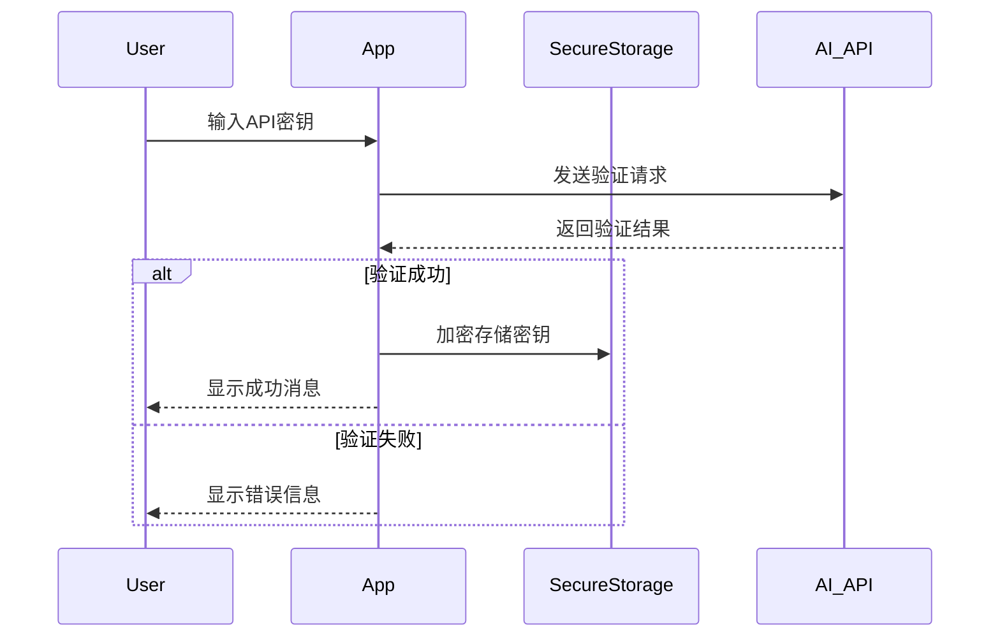

# ZenX AI聊天应用 API集成指南

## 一、支持的API服务商

ZenX应用计划支持以下主流AI服务商的API：

| 服务商 | API版本 | 支持模型 | 特点 |
|-------|---------|---------|------|
| OpenAI | GPT-API | GPT-4o, GPT-3.5-Turbo | 强大的通用能力，流式响应 |
| Anthropic | Claude API | Claude 3 Opus, Sonnet, Haiku | 长上下文支持，安全性 |
| Google | Gemini API | Gemini Pro, Ultra | 多模态支持 |
| Mistral AI | API | Mistral Medium, Large | 开放、高效 |
| Ollama | API | 多种开源模型 | 本地部署选项 |

## 二、API集成架构

### 统一接口设计

所有API服务商通过统一抽象接口实现，确保可插拔和一致性：

```dart
abstract class BaseChatAPI {
  // 发送消息并返回流式响应
  Future<StreamedResponse> sendMessage({
    required String message,
    required MessageHistory history,
    required ApiConfig config
  });
  
  // 获取服务商名称
  String get vendorName;
  
  // 获取品牌颜色
  Color get brandColor;
  
  // 获取支持的模型列表
  List<String> get supportedModels;
  
  // 检查API配置是否有效
  Future<bool> validateApiKey(String apiKey);
}
```

### 流式响应处理

使用Dart Streams处理AI的实时响应：

```dart
class StreamedResponse {
  final Stream<String> textStream;
  final Stream<Map<String, dynamic>>? metadataStream;
  
  StreamedResponse({
    required this.textStream,
    this.metadataStream,
  });
}
```

## 三、API密钥管理

### 安全存储
- 使用`flutter_secure_storage`加密存储所有API密钥
- 应用内存中仅保留会话期间需要的密钥
- 支持生物识别验证（可选）

### 密钥验证流程


## 四、实现指南

### OpenAI API实现示例

```dart
class OpenAIAPI extends BaseChatAPI {
  @override
  String get vendorName => 'OpenAI';
  
  @override
  Color get brandColor => const Color(0xFF10A37F);
  
  @override
  List<String> get supportedModels => [
    'gpt-4o', 
    'gpt-4-turbo', 
    'gpt-3.5-turbo'
  ];
  
  @override
  Future<StreamedResponse> sendMessage({
    required String message,
    required MessageHistory history,
    required ApiConfig config,
  }) async {
    final dio = Dio();
    dio.options.headers['Authorization'] = 'Bearer ${config.apiKey}';
    dio.options.headers['Content-Type'] = 'application/json';
    
    final List<Map<String, dynamic>> messages = [];
    
    // 添加历史消息
    for (final msg in history.messages) {
      messages.add({
        'role': msg.isUser ? 'user' : 'assistant',
        'content': msg.content,
      });
    }
    
    // 添加当前消息
    messages.add({
      'role': 'user',
      'content': message,
    });
    
    final response = await dio.post(
      'https://api.openai.com/v1/chat/completions',
      data: {
        'model': config.modelName ?? 'gpt-3.5-turbo',
        'messages': messages,
        'stream': true,
        'temperature': config.temperature ?? 0.7,
      },
      options: Options(
        responseType: ResponseType.stream,
      ),
    );
    
    // 处理流式响应
    final stream = response.data.stream.transform(
      StreamTransformer.fromHandlers(
        handleData: (data, sink) {
          final String text = utf8.decode(data);
          final List<String> lines = text.split('\n');
          
          for (var line in lines) {
            if (line.startsWith('data: ') && line != 'data: [DONE]') {
              final jsonData = line.substring(6);
              try {
                final Map<String, dynamic> json = jsonDecode(jsonData);
                final choice = json['choices'][0];
                final content = choice['delta']['content'];
                if (content != null) {
                  sink.add(content);
                }
              } catch (e) {
                // 忽略解析错误
              }
            }
          }
        },
      ),
    );
    
    return StreamedResponse(textStream: stream);
  }
  
  @override
  Future<bool> validateApiKey(String apiKey) async {
    try {
      final dio = Dio();
      dio.options.headers['Authorization'] = 'Bearer $apiKey';
      
      final response = await dio.get('https://api.openai.com/v1/models');
      return response.statusCode == 200;
    } catch (e) {
      return false;
    }
  }
}
```

### Claude API实现要点

- 使用Anthropic的官方API端点
- 处理较长上下文窗口
- 可能需要特殊处理工具调用格式

### Gemini API实现要点

- 支持多模态输入（如图像）
- 按Google API规范处理鉴权
- 处理较特殊的流式响应格式

## 五、错误处理

### 通用错误类型
```dart
enum ApiErrorType {
  authError,      // 鉴权错误
  quotaExceeded,  // 配额超限
  rateLimit,      // 速率限制
  invalidRequest, // 无效请求
  serverError,    // 服务器错误
  networkError,   // 网络错误
  unknownError,   // 未知错误
}

class ApiError {
  final ApiErrorType type;
  final String message;
  final dynamic originalError;
  
  ApiError({
    required this.type,
    required this.message,
    this.originalError,
  });
}
```

### 错误处理策略
- 常见限流错误自动重试
- 提供用户友好的错误提示
- 记录详细错误日志以便调试

## 六、扩展性设计

### 添加新API服务商流程
1. 创建新的API实现类继承自BaseChatAPI
2. 实现所有需要的方法和属性
3. 在ApiProvider中注册新的API实现
4. 在UI中添加对应的选择选项

### 配置自定义端点
支持配置自定义API端点，便于连接私有部署或代理服务：

```dart
class ApiConfig {
  final String apiKey;
  final String? modelName;
  final double? temperature;
  final String? customEndpoint;
  final Map<String, dynamic>? additionalParams;
  
  ApiConfig({
    required this.apiKey,
    this.modelName,
    this.temperature,
    this.customEndpoint,
    this.additionalParams,
  });
}
```

## 七、性能考量

### 连接优化
- 使用HTTP/2支持
- 保持连接复用
- 实现超时和重试机制

### 内存管理
- 流式响应处理避免大字符串拼接
- 历史消息窗口管理，避免无限增长

## 八、测试方法

### 单元测试
- 使用Mock服务模拟API响应
- 测试各种错误场景
- 验证流式处理正确性

### 集成测试
- 使用真实API密钥进行完整流程测试
- 验证不同模型的兼容性
- 性能和稳定性测试 